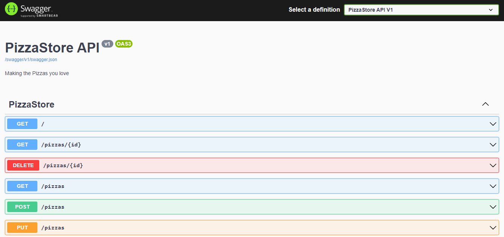

# MicrosoftBuild-desafio.NET-minimalAPI
Projeto para aplicação de Minimal API, um dos módulos do Microsoft Build: desafio .NET

Neste módulo foi ensinado a criarmos uma API usando o modelo de API mínima para .NET 6.

A ideia por trás da API mínima é que você pode criar uma API com apenas algumas linhas de código, o que é bem legal e super simples!

Ela tem todos os recursos importantes que são necessários, como injeção de dependência, comunicação com bancos de dados e 
gerenciamento de rotas.

A principal diferença com a API mínima, é que precisamos especificar explicitamente as rotas que desejamos, ao invés de contar
com uma abordagem automática, como acontece em outros modelos.

Existem várias vantagens nessa abordagem:
- É super fácil começar. Com apenas algumas linhas de código, você pode ter uma API funcionando rapidamente. 
- Você pode ir adicionando mais recursos conforme precisar deles, mantendo o código pequeno e organizado. 
- Aproveitar os recursos mais recentes do .NET 6, o que é ótimo para estar sempre atualizado.

Um dos pontos mais interessantes que achei foi o uso do Swagger, que é uma ferramenta bem legal para documentar uma API. Facilita bastante
à vida de criar uma documentação rs. Ela adiciona rotas para criar, ler, atualizar e excluir um recurso.

[Documentação do Swagger](https://swagger.io/){:target="_blank"}

